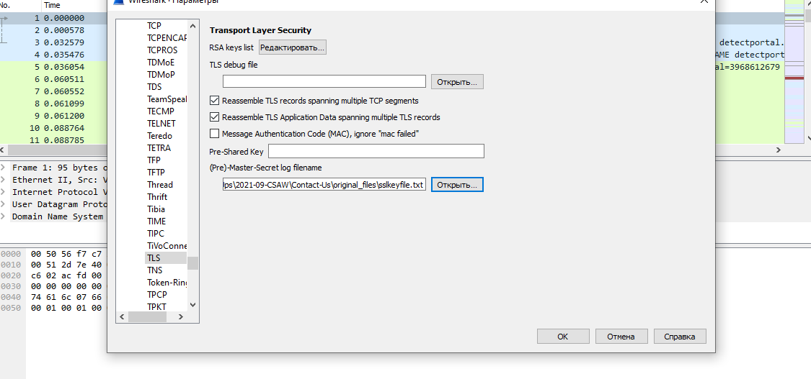
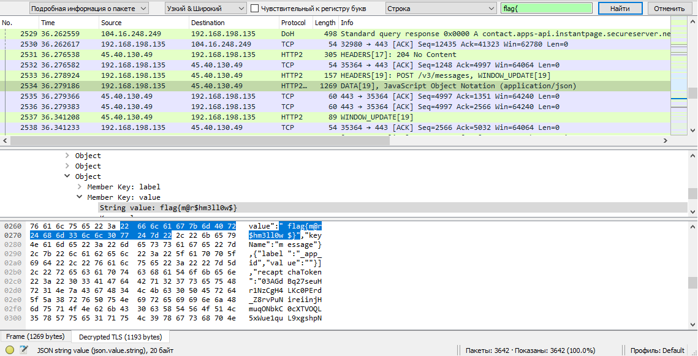

# CSAW CTF Qualification Round 2021 Write-up. Forensics - Contact Us

## Description:
Veronica sent a message to her client via their website's Contact Us page. Can you find the message?

Author: moat, Pacific Northwest National Laboratory

| Value | Difficulty   |
| ----- | ------------ |
| 175   | Easy         |

<br>

## Write-up:

After looking into `ContactUs.pcap` it becomes clear that we are interested in TLS traffic, to decrypt it we need to import ssl encryption keys from `sslkeyfile.txt`.

Navigate through `Edit -> Preferences -> Protocols -> TLS -> (Pre)-Master-Secret log filename`, click browse and select the `sslkeyfile.txt` file.



Then we search for **string value** `flag{` in **packet details**:



<br>

Found flag:
```log
flag{m@r$hm3ll0w$}
```

<br>

The original challenge files can be found [here](https://github.com/requroku/CTFWriteUps/tree/main/2021-09-CSAW/Contact-Us/original_files).
