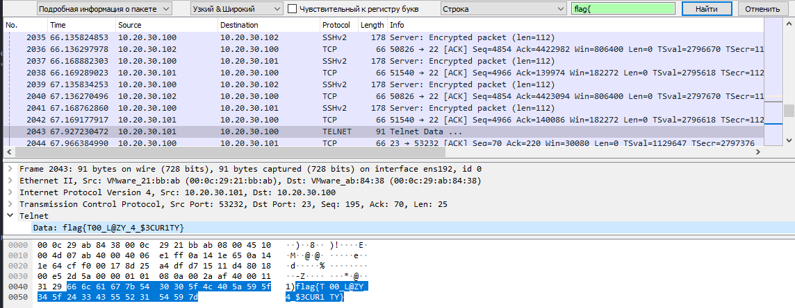

# CSAW CTF Qualification Round 2021 Write-up. Forensics - Lazy Leaks

## Description:
Someone at a company was supposedly using an unsecured communication channel. A dump of company communications was created to find any sensitive info leaks. See if you can find anything suspicious or concerning.

Author: Andrew Prajogi

| Value | Difficulty   |
| ----- | ------------ |
| 50    | Easy         |

<br>

## Write-up:

Challenge description gives a hint that we need to look into unsecured protocols in `Lazy_Leaks.pcapng`. We simply search for **string value** `flag{` in **packet details** and get the flag:



<br>

Found flag:
```log
flag{T00_L@ZY_4_$3CUR1TY}
```

<br>

The original challenge files can be found [here](https://github.com/requroku/CTFWriteUps/tree/main/2021-09-CSAW/Lazy-Leaks/original_files).
