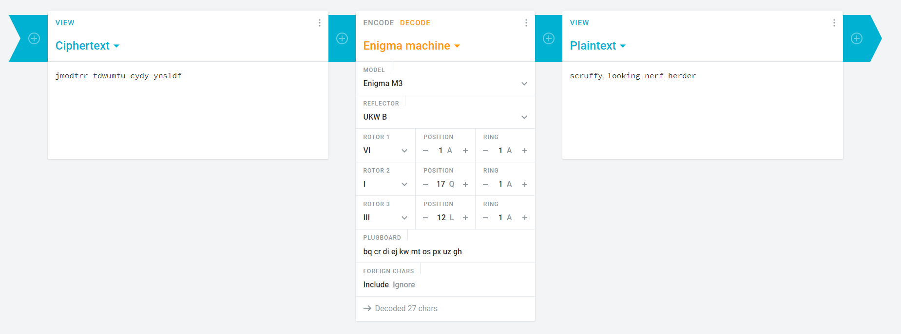

# CSAW CTF Qualification Round 2021 Write-up. Warm-up - Turing

## Description:
Recruiting the next Turing. See if you can break this historic cipher!
Ciphertext: **jmodtrr_tdwumtu_cydy_ynsldf**
You might need this: M3 UKW B

| Value | Difficulty   |
| ----- | ------------ |
| 25    | Easy         |

<br>

## Write-up:

Taking into consideration hints given into the challenge name (*Turing*), *historic cipher* and *M3 UKW B*. It can be deduced that we are dealing with Enigma machine. **M3** stands for Enigma M3 model, **UKW B** (Umkehrwalze-B) was the standard reflector during the war.

<br>

Using [Cryptii](https://cryptii.com/pipes/enigma-machine) online Enigma machine tool with the given parameters we can easily get the flag.



```log
flag{scruffy_looking_nerf_herder}
```
