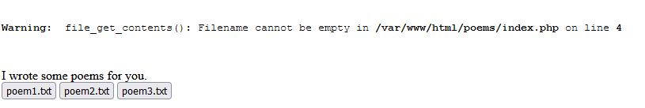

# CSAW CTF Qualification Round 2021 Write-up. Warm-up - poem-collection

## Description:
Hey! I made a cool website that shows off my favorite poems. See if you can find **flag.txt** somewhere!  
http://web.chal.csaw.io:5003

| Value | Difficulty   |
| ----- | ------------ |
| 25    | Easy         |

<br>

## Write-up:

The link takes us to a site with a link to directory `/poems`, however there is already an error message:



If we click on the button with corresponding filename, for example `poem1.txt`, it populates variable `poem` with this value inside url and displays file contents.


If we try to change variable `poem` to `flag.txt`:
```log
web.chal.csaw.io:5003/poems/?poem=flag.txt
```
it gives an error.

However. we can try to change this parameter to
```log
?poem=../flag.txt
```
to look for file `flag.txt` in upper directory. And this attempt is a success!

<br>

Thus, the flag is:
```log
flag{l0c4l_f1l3_1nclusi0n_f0r_7h3_w1n}
```
