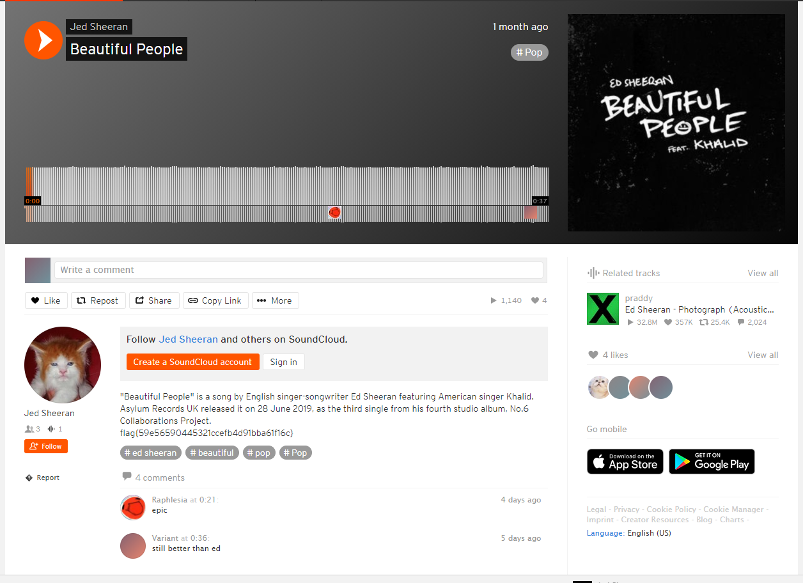

# H@cktivityCon 2021 Write-up. OSINT - Jed Sheeran

## Description:
Oh we have another fan with a budding music career! Jed Sheeran is seemingly trying to produce new songs based off of his number one favorite artist... but it doesn't all sound so good. Can you find him?

| Value | Difficulty   |
| ----- | ------------ |
| 50    | Medium       |

<br>

## Write-up:
Jed Sheeran was the easiest OSINT target. Taking into account that it should be related to music somehow, I constructed a simple Google Search query specifying the site to search on as SoundCloud.

```log
Jed Sheeran site:soundcloud.com
```

Let's check the first link.


Looking at the profile, that's probably our guy.


If we play his only song, there is a loud, siren-like beeping. This is probably going to call for a spectrogram and steganography. **HOWEVER**, by the time I got to this challenge, flag was already placed into the description of the song.



If you try and decode the stego, you’d find that it was a Slow-Scan Television signal ([SSTV](https://en.wikipedia.org/wiki/Slow-scan_television)), but it was so hard to read the flag so authors just threw it in the description.


<br>

The flag is:
```log
flag{59e56590445321ccefb4d91bba61f16c}
```
