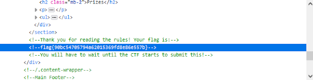

# H@cktivityCon 2021 Write-up. Warmups - Read The Rules

## Description:
Please follow the rules for this CTF!

| Value | Difficulty   |
| ----- | ------------ |
| 50    | Easy         |

<br>

## Write-up:
This was probably the easiest challenge in the whole event. As the title says, you just go to the rules page and find the flag in the page’s source code.



<br>

The flag is:
```log
flag{90bc54705794a62015369fd8e86e557b}
```