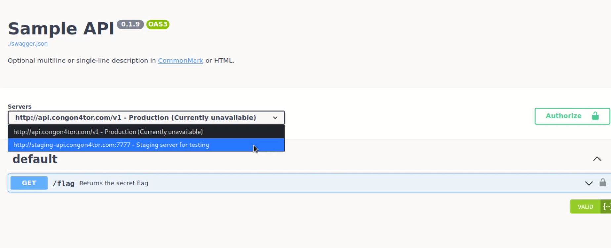
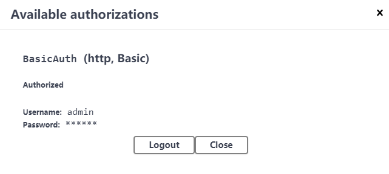
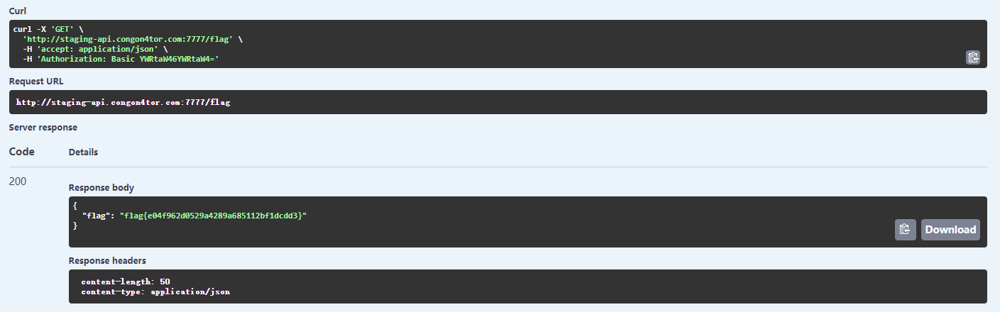

# H@cktivityCon 2021 Write-up. Web - Swaggy

## Description:
This API documentation has all the swag.

| Value | Difficulty   |
| ----- | ------------ |
| 50    | Easy         |

<br>

## Write-up:
There are two servers.



Testing server needs authorization, let's give it a try. The vulnerability here is a weak password `admin:admin`



After logging in, we execute the API query and get the flag.



<br>

```log
flag{e04f962d0529a4289a685112bf1dcdd3}
```
