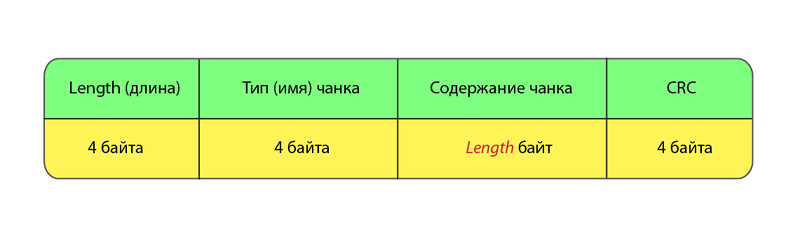
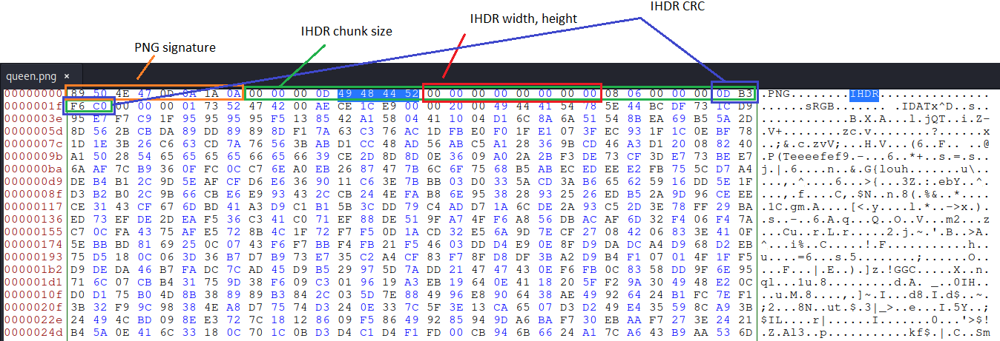
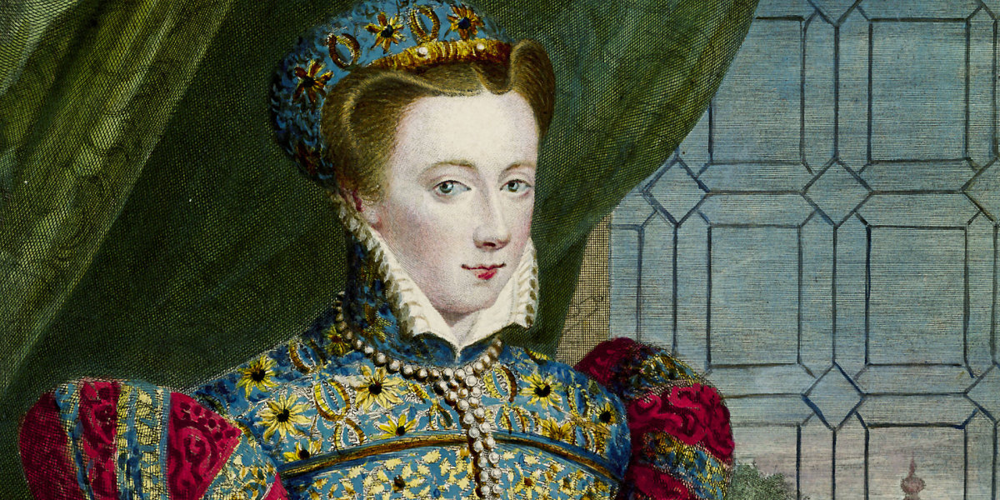
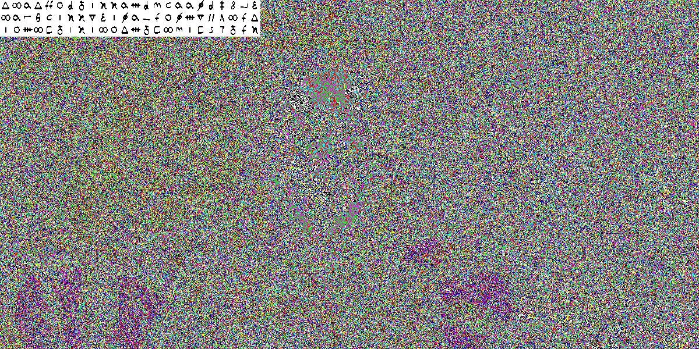

# Killer Queen CTF 2021. [forensics] Shes A Killed Queen

## Description:
My picture has been corrupted. Can you fix it?
[queen.png](./img/queen.png)

<br>

| Value | Difficulty   |
| ----- | ------------ |
| 290   | Medium       |

<br>

## Write-up:

First we try to open given image - reasonably it does not open.

Then we use `pngcheck` utility to get information about what is wrong with our image.

```sh
$ pngcheck -vv queen.png     
File: queen.png (2147301 bytes)
  chunk IHDR at offset 0x0000c, length 13:  invalid image dimensions (0x0)
ERRORS DETECTED in queen.png
```

Here we can see that the dimensions in required IHDR chunk are all set to 0.

[Specification](http://www.libpng.org/pub/png/spec/1.2/PNG-Structure.html) says that a PNG file consists of a PNG signature followed by a series of chunks.
A PNG signature is always the same and consists of 8 bytes:
> 89 50 4E 47 0D 0A 1A 0A

Each chunk consists of four parts:
 - **Length**: A 4-byte unsigned integer giving the number of bytes in the chunk's data field. The length counts only the data field, not itself, the chunk type code, or the CRC. Zero is a valid length. Although encoders and decoders should treat the length as unsigned, its value must not exceed 231 bytes.
- **Chunk Type**: A 4-byte chunk type code. Uppercase and lowercase ASCII letters have their specific meaning here.
- **Chunk Data**: The data bytes appropriate to the chunk type, if any. This field can be of zero length.
- **CRC**: A 4-byte CRC (Cyclic Redundancy Check)



The [IHDR](https://www.w3.org/TR/2003/REC-PNG-20031110/#11IHDR) chunk shall be the first chunk in the PNG datastream. It contains:

| Field values | Size |
|---|---|
| Width	| 4 bytes |
| Height | 4 bytes |
| Bit depth | 1 byte |
| Colour type | 1 byte |
| Compression method | 1 byte |
| Filter method | 1 byte |
| Interlace method | 1 byte |

<br>

After looking at queen.png with hex editor, it's clear that dimensions values have to be set.



CRC of IHDR chunk inside given `queen.png` does not match with CRC, calculated for this png with zero dimensions, thus we assume that CRC must have been calculated using correct image dimensions:
> 0D B3 F6 C0

Time to find these dimensions using brute force!

```python
#!/usr/bin/env python3

from pwn import p32
from zlib import crc32


required_crc = 0x0DB3F6C0
max_dimension = 4000

for width in range(0, max_dimension):
    for height in range(0, max_dimension):
        ihdr = b'\x49\x48\x44\x52' + p32(width, endian='big') + p32(height, endian='big') + b'\x08\x06\x00\x00\x00'
        
        if height % 100 == 0:
            print('ihdr:', ihdr.hex())
        
        crc = crc32(ihdr)
        if crc == required_crc:
            print('FOUND!')
            print(width, height)
            exit()
```

This gives the following result:
```log
FOUND!
1200 675
```

After editing these values in hex, we get the following image:



Using `stegsolve` on this image we definitely get some kind of cipher:



After a little bit of googling we can find out that the queen on the image is *Mary, Queen of Scots*, also known as *Mary Stuart*. After googling a little bit more about her and any relations to ciphers, we can find out that she is well known for her substitution cipher called **Mary Stuart Code**.

Using online [Mary Stuart Code](https://www.dcode.fr/mary-stuart-code) tool we can get decode the flag.

<br>

The flag:
```log
kqctf{SHES_A_KILLED_QUEEN_BY_THE_GUILLOTINE_RANDOMCHRSIADHFKILIHASDKFHQIFPXKRL}
```

<br>

The full source code and task file can be found [here](https://github.com/requroku/CTFWriteUps/tree/main/2021-10-Killer-Queen-CTF/Shes-A-Killed-Queen).