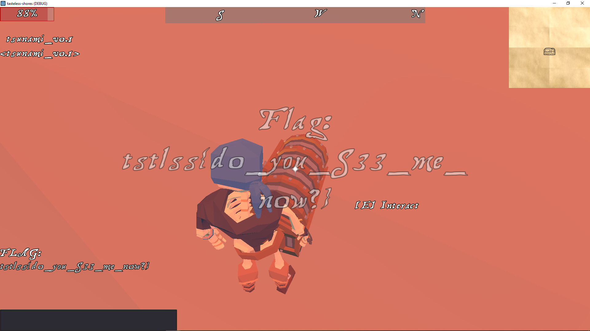

# TastelessCTF 2021 Write-up. [game] Skull Island

## Description:
Find the flag in the eye of the danger (in the game)!

https://ctf.tasteless.eu/tasteless-shores

<br>

| Value | Difficulty   |
| ----- | ------------ |
| 443   | Medium       |

<br>

## Write-up:
In this challenge we're given a game [Tasteless Shores](https://ctf.tasteless.eu/tasteless-shores) and the flags are have to be found inside it.

After logging in and running around for a bit, it was obvious that challenge description gives a hint for where we have to find a flag. And the flag must be in one of the skull eyes.



However, it was not so easy to get there. Character must have a boat to travel to different islands, otherwise it will die.
According to organizers hint, before this challenge another have to be done, where we acquire a boat. I was not able to solve previous challenge, but found a workaround.


<br>

And the flag is:
```log
tstlss{do_you_S33_me_now?}
```
